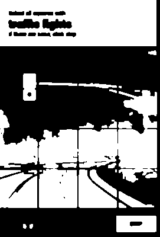

# captcha-object-segmentation
CAPTCHA Object Segmentation is a Computer Vision project designed to detect, segment, and extract individual objects (such as characters or symbols) from visually complex CAPTCHA-style images.

# CAPTCHA Object Segmentation

A computer vision project to detect, extract, and segment visual objects from CAPTCHA-like images using OpenCV.

## 🧠 Objective
Segment grid-like images containing objects or characters from noisy or framed CAPTCHA images — without using deep learning.

## 🛠️ Features

- Frame and grid line removal
- Object extraction via fixed grid or bounding boxes
- Object filtering based on pixel density
- Visual debugging with Matplotlib
- Robust even in noisy, misaligned, or complex images

## 🖼️ Example

Original CAPTCHA:

Extracted Objects:

## 📁 Project Structure
captcha-object-segmentation/
├── Data/ # Raw input images
├── Results/ # Output images (auto-generated)
├── notebooks/ # Jupyter notebooks
├── src/ # (Optional) Python modules
├── README.md
├── requirements.txt
└── .gitignore
